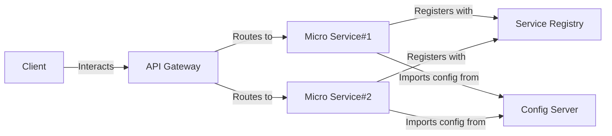

# Spring Boot MSA
`springboot-msa` 프로젝트는 Spring Boot 기반의 마이크로서비스 아키텍처를 구현한 프로젝트입니다.

---

## 목차
1. [프로젝트 정보](#프로젝트-정보)
2. [서비스 구성](#서비스-구성)
3. [데이터베이스 세팅](#데이터베이스-세팅)
4. [구동 절차](#구동-절차)
5. [부록](#부록)

---

## 프로젝트 정보


---

## 서비스 구성
`api-gateway`, `config-server`, `service-registry`, `micro-service` 4 종류의 서비스로 구성되어 있습니다.

_`분산 추적 모니터링`, `message-queue`, `event-sourcing`은 추후 구현할 예정._

### 서비스 목록
- [config-server](./config-server/README.md)
- [api-gateway](./api-gateway/README.md)
- [service-registry](./service-registry/README.md)
- [user-service](./user-service/README.md)
- [security-service](./security-service/README.md)

### Micro Service 구현 규칙
- `micro-service`는 `netflix-eureka-client`로 구성하였습니다.
- `micro-service`는 구동할 때 `service-registry`에 클라이언트로써 등록을 요청합니다.
- `micro-service`는 구동할 때 `config-server`의 설정 정보를 import합니다.
- `micro-service`는 독자적인 생명 주기를 가져야 합니다.
- `micro-service`는 독립적인 데이터베이스를 가질 수 있어야 합니다. 즉 다른 모듈에 대한 제약 조건이 있으면 안된다. 제약 조건이 필요한 경우(정합성 및 일관성이 비즈니스에 중요한 요소일 경우) `Bounded Context`의 범위를 조절하여 도메인을 구성할 수 있도록 합니다.
- `micro-service`는 RESTful API를 제공해야 합니다. **REST API 성숙도 3단계 모델**을 따르도록 합니다.
- `micro-service`는 **OpenAPI Specification 3.x.x** 버전에 맞게 작성되어야 합니다.
- `micro-service`는 OpenAPI Specification을 사용하여 API 문서를 자동으로 생성해야 합니다. 이는 **Swagger**를 사용하여 구현합니다.
- `micro-service`는 테스트 가능한 코드를 작성해야 합니다. 테스트 코드는 **단위 테스트**, **슬라이스 테스트**를 작성하도록 합니다.
- `micro-service`는 특정 **Persistence Framework**에 의존적인 코드를 최소화하도록 합니다.([Dirty Check 지양](#dirty-check-지양), [JpaRepository 지양](#jparepository-및-spring-data-jpa가-자동으로-주입해주는-인터페이스-지양))
- `micro-service`는 **Spring Boot Actuator**를 사용하여 모니터링 및 관리 기능을 제공해야 합니다.

---

### 데이터베이스 세팅
현재 기본값으로 설정된 DBMS 벤더는 H2입니다.
hibernate 구성 설정으로 애플리케이션 구동 시 자동으로 데이터베이스 테이블을 생성하도록 설정되어 있습니다.
```yaml
# Datasource
spring.datasource.driver-class-name: org.h2.Driver
spring.datasource.url: jdbc:h2:mem:testdb
#spring.datasource.url=jdbc:h2:file:./testdb # H2 데이터베이스를 파일 기반으로 사용할 경우 주석을 해제할 것
spring.datasource.username: sa
spring.datasource.password: password

spring.jpa.show-sql: true
spring.jpa.database-platform: org.hibernate.dialect.H2Dialect
spring.jpa.hibernate.ddl-auto: update
```

PostgreSQL을 사용할 경우에는 아래의 스크립트를 실행 후 설정 파일을 수정합니다.
```sql
-- 데이터베이스 생성
CREATE DATABASE august;

-- 계정 생성
CREATE USER kalgooksoo WITH PASSWORD '1234';

-- 데이터베이스에 대한 모든 권한 부여
GRANT ALL PRIVILEGES ON DATABASE august TO kalgooksoo;

-- august 데이터베이스 접속

-- 스키마 생성
CREATE SCHEMA springboot_msa;

-- 스키마에 대한 모든 권한 부여
GRANT ALL PRIVILEGES ON SCHEMA springboot_msa TO kalgooksoo;
```
```yaml
# Datasource
spring.datasource.driver-class-name: org.postgresql.Driver
spring.datasource.url: jdbc:postgresql://localhost:5432/august?currentSchema=springboot_msa
spring.datasource.username: kalgooksoo
spring.datasource.password: 1234

spring.jpa.open-in-view: true
spring.jpa.show-sql: true
spring.jpa.database-platform: org.hibernate.dialect.PostgreSQLDialect
spring.jpa.hibernate.ddl-auto: update
```

---

### 구동 절차
1. `ConfigServerApplication` 실행
2. `ServiceRegistryApplication` 실행
3. `GatewayApplication` 실행
4. 그 외 `MicroserviceApplication` 실행

---

### 부록
1. [OpenAPI Specification](#openapi-specification)
2. [특정 Persistence Framework에 의존적인 코드 지양](#특정-persistence-framework에-의존적인-코드-지양)
3. [JpaRepository 및 Spring Data JPA가 자동으로 주입해주는 인터페이스 지양](#jparepository-및-spring-data-jpa가-자동으로-주입해주는-인터페이스-지양)
4. [Dirty Check 지양](#dirty-check-지양)
5. [Data Access Layer에서는 비즈니스 로직을 최소화합니다.](#data-access-layer에서는-비즈니스-로직을-최소화합니다.)
6. [Update command에 대해서는 조회 -> 수정 -> 저장 순서로 처리합니다.](#update-command에-대해서는-조회---수정---저장-순서로-처리합니다.)
7. [Data Access Layer에서는 비즈니스 로직을 최소화합니다.](#data-access-layer에서는-비즈니스-로직을-최소화합니다.)

#### OpenAPI Specification
이 프로젝트는 `springdoc-openapi`을 사용하여 API 문서를 자동으로 생성합니다.<br>
Swagger UI를 통해 API 문서를 실시간으로 확인하려면 웹 브라우저에서 `{micro-service}/swagger-ui/index.html` 경로로 접속합니다.<br>
OAS 형식의 API 문서는 `{micro-service}/v3/api-docs.yaml` 경로에서 파일을 다운로드할 수 있습니다.

#### 특정 Persistence Framework에 의존적인 코드 지양
특정 `Persistence Framework`에 의존적인 코드를 지양하기 위해서 `Data Access Layer`의 인터페이스 명세에는 벤더 의존적인 코드를 최소화하였습니다.<br>
예를 들어 `Data Access Layer`의 인터페이스 명세에 `Specification`을 지양합니다.
`MyBatis`, `IBatis`, `Hibernate` 등의 `Persistence Framework`를 선택하여 사용할 수 있도록 하기 위함입니다.

##### 사족
하지만 도메인 엔티티 클래스에 `Hibernate` 의존 코드(애노테이션)가 들어있습니다. 이는 `Persistence Framework`에 의존적인 코드이지만 분리하려면 외부 파일로 분리해야 하고 이는 복잡성을 증가시키기 때문에 현재로서는 트레이드 오프를 위해 허용하였습니다.
따라서 `MyBatis`, `IBatis` 등의 `Persistence Framework`를 사용할 경우에는 `Hibernate` 의존 코드를 제거하고 사용하도록 합니다.

##### DBMS 벤더에 의존적인 쿼리 지양
또한 DBMS 벤더에 의존적인 쿼리를 지양하기 위해 JPQL을 사용하였습니다.
```java
/**
 * 검색 조건에 기반한 계정 목록 조회
 *
 * @param search   검색 조건
 * @param pageable 페이지네이션 정보
 * @return 계정 목록
 */
@Override
public Page<User> search(UserSearch search, Pageable pageable) {
    String jpql = "select user from User user where 1=1";
    jpql += generateJpql(search);

    TypedQuery<User> query = em.createQuery(jpql, User.class);
    setParameters(query, search);
    query.setFirstResult((int) pageable.getOffset());
    query.setMaxResults(pageable.getPageSize());

    List<User> users = query.getResultList();

    String countJpql = "select count(user) from User user where 1=1";
    countJpql += generateJpql(search);

    TypedQuery<Long> countQuery = em.createQuery(countJpql, Long.class);
    setParameters(countQuery, search);

    Long count = countQuery.getSingleResult();

    return new PageImpl<>(users, pageable, count);
}

private String generateJpql(UserSearch search) {
    StringBuilder jpql = new StringBuilder();
    if (!search.isEmptyUsername()) {
        jpql.append(" and user.username like :username");
    }
    if (!search.isEmptyName()) {
        jpql.append(" and user.name like :name");
    }
    if (!search.isEmptyEmailId()) {
        jpql.append(" and user.emailId like :emailId");
    }
    if (!search.isEmptyContactNumber()) {
        jpql.append(" and user.contactNumber like :contactNumber");
    }
    return jpql.toString();
}

private void setParameters(TypedQuery<?> query, UserSearch search) {
    if (!search.isEmptyUsername()) {
        query.setParameter("username", "%" + search.getUsername() + "%");
    }
    if (!search.isEmptyName()) {
        query.setParameter("name", "%" + search.getName() + "%");
    }
    if (!search.isEmptyEmailId()) {
        query.setParameter("emailId", "%" + search.getEmailId() + "%");
    }
    if (!search.isEmptyContactNumber()) {
        query.setParameter("contactNumber", "%" + search.getContactNumber() + "%");
    }
}
```

#### JpaRepository 및 Spring Data JPA가 자동으로 주입해주는 인터페이스 지양
1. 실제로 사용하지 않는 메서드는 지양합니다.
2. 인터페이스의 간단한 `Mocking`, `Stubbing`을 위해 지양합니다.
3. 추후 `CQRS` 패턴 도입을 위해 지양합니다.
4. `Persistence Framework`에 의존적인 코드 최소화를 위해 지양합니다.

#### Dirty Check 지양
`Persistence Framework`에 의존적인 코드 최소화를 위해 지양합니다. 따라서 영속화 코드를 명시적으로 작성하였습니다.
```java
/**
 * 패스워드 변경
 *
 * @param id             계정 식별자
 * @param originPassword 기존 패스워드
 * @param newPassword    새로운 패스워드
 */
@Override
public void updatePassword(String id, String originPassword, String newPassword) {
    User user = userRepository.findById(id).orElseThrow(() -> new NoSuchElementException("계정을 찾을 수 없습니다."));
    if (!passwordEncoder.matches(originPassword, user.getPassword())) {
        throw new IllegalArgumentException("계정 정보가 일치하지 않습니다.");
    }
    user.changePassword(passwordEncoder.encode(newPassword));
    userRepository.save(user);
}
```

#### Data Access Layer에서는 비즈니스 로직을 최소화합니다.
`Data Access Layer`에서는 비즈니스 로직을 최소화하고, 단순한 `CRUD` 작업을 수행하도록 합니다.<br>
데이터베이스 커넥션 없이 단위테스트를 할 수 있도록 하기 위함입니다.

#### Update command에 대해서는 조회 -> 수정 -> 저장 순서로 처리합니다.
`Data Access Layer`의 비즈니스 로직을 최소화하기 위함입니다.<br>
_추후 도메인 엔티티에 `@Version`을 사용하여 `Optimistic Locking`을 적용할 예정입니다._
