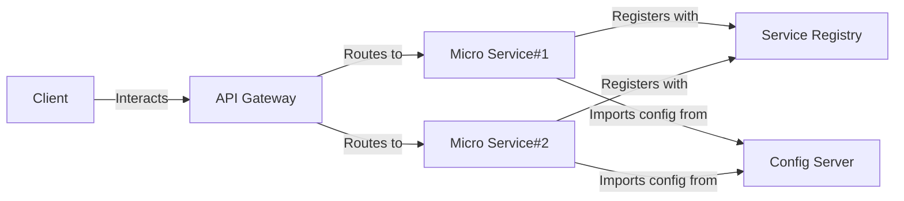

# Spring Boot MSA
`springboot-msa` 프로젝트는 Spring Boot 기반의 마이크로서비스 아키텍처를 구현한 프로젝트입니다.

[태스크 목록 바로가기](https://github.com/users/KalGookSoo/projects/3)

---

## 목차
1. [프로젝트 정보](#프로젝트-정보)
2. [서비스 구성](#서비스-구성)
3. [구동 절차](#구동-절차)
4. [OpenAPI 명세](#openapi-명세)

---

## 프로젝트 정보

`micro-service`는 해당 버전과 언어를 준수하지 않더라도 OpenAPI 3.x.x 버전에 맞게 API를 제공한다면 자유롭게 구현해도 좋습니다.

---

## 서비스 구성
`api-gateway`, `config-server`, `service-registry`, `micro-service` 4 종류의 서비스로 구성되어 있습니다.

### 서비스 목록
- [config-server](./config-server/README.md)
- [service-registry](./service-registry/README.md)
- [api-gateway](./api-gateway/README.md)
- [acl-service](./micro-service/acl/README.md)
- [article-service](./micro-service/article/README.md)
- [attachment-service](./micro-service/attachment/README.md)
- [category-service](./micro-service/category/README.md)
- [comment-service](./micro-service/comment/README.md)
- [kafka-service](./micro-service/kafka/README.md)
- [menu-service](./micro-service/menu/README.md)
- [security-service](./micro-service/security/README.md)
- [user-service](./micro-service/user/README.md)
- [view-service](./micro-service/view/README.md)
- [vote-service](./micro-service/vote/README.md)

---

## 구동 절차
1. `ConfigServerApplication` 실행
2. `ServiceRegistryApplication` 실행
3. `GatewayApplication` 실행
4. 그 외 `MicroserviceApplication` 실행

---

## OpenAPI 명세
- [acl-service](./docs/oas/acl-service-api-docs.yaml)
- [article-service](./docs/oas/article-service-api-docs.yaml)
- [attachment-service](./docs/oas/attachment-service-api-docs.yaml)
- [category-service](./docs/oas/category-service-api-docs.yaml)
- [comment-service](./docs/oas/comment-service-api-docs.yaml)
- [kafka-service](./docs/oas/kafka-service-api-docs.yaml)
- [menu-service](./docs/oas/menu-service-api-docs.yaml)
- [security-service](./docs/oas/security-service-api-docs.yaml)
- [user-service](./docs/oas/user-service-api-docs.yaml)
- [view-service](./docs/oas/view-service-api-docs.yaml)
- [vote-service](./docs/oas/vote-service-api-docs.yaml)