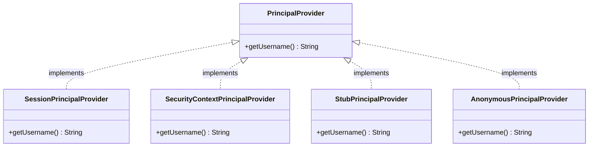

# Core Principal
`core-principal`은 인증 주체를 반환하기 위한 추상 인터페이스와 구현체를 제공합니다.

##

```mermaid
classDiagram
    PrincipalProvider <|.. SessionPrincipalProvider: implements
    PrincipalProvider <|.. SecurityContextPrincipalProvider: implements
    PrincipalProvider <|.. StubPrincipalProvider: implements
    PrincipalProvider <|.. AnonymousPrincipalProvider: implements
    PrincipalProvider : +getUsername() String
    SessionPrincipalProvider : +getUsername() String
    StubPrincipalProvider : +getUsername() String
    AnonymousPrincipalProvider : +getUsername() String
    SecurityContextPrincipalProvider : +getUsername() String
```