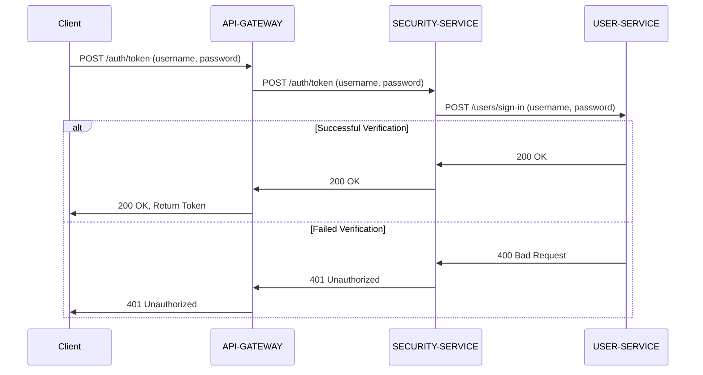

# SECURITY-SERVICE
`SECURITY-SERVICE`는 사용자 인증 및 인가 부여를 담당하는 서비스입니다.

---

## 목차
1. [프로젝트 정보](#프로젝트-정보)
2. [토큰 발급 시나리오](#토큰-발급-시나리오)
3. [API 명세서](#api-명세서)

---

## 프로젝트 정보
- **프로그래밍 언어**: Java
- **Java 버전**: 17
- **빌드 도구**: Gradle
- **스프링 부트 버전**: 3.2.2
- **스프링 클라우드 버전**: 2023.0.0

---

## 토큰 발급 시나리오
