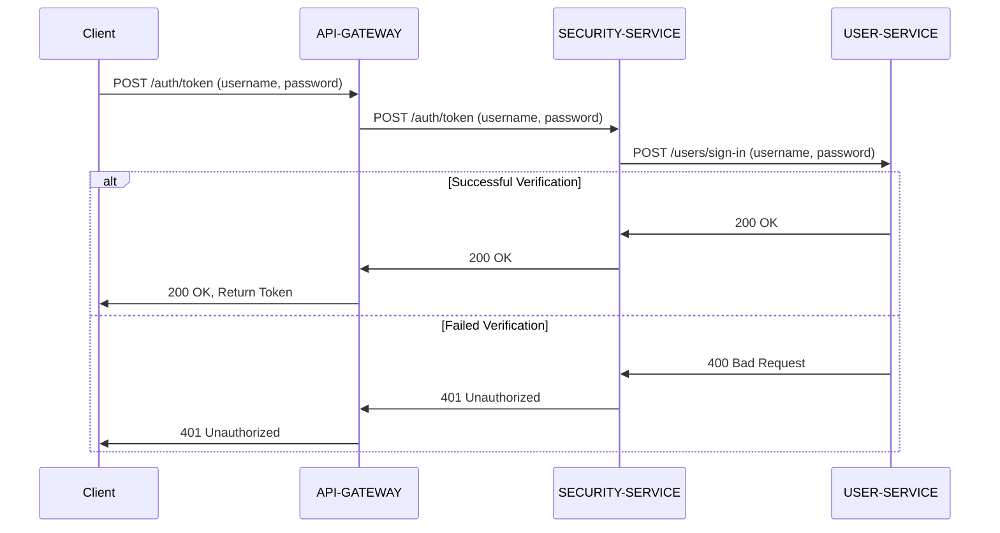

# Security Service
`security-service`는 사용자 인증 및 인가 부여를 담당하는 서비스입니다.

---

## 목차
1. [프로젝트 정보](#프로젝트-정보)
2. [토큰 발급 시나리오](#토큰-발급-시나리오)
3. [API 명세서](#api-명세서)

---

## 프로젝트 정보

---

## 토큰 발급 시나리오

```mermaid
sequenceDiagram
    participant Client as Client
    participant ApiGateway as API-GATEWAY
    participant SecurityService as SECURITY-SERVICE
    participant UserService as USER-SERVICE

    Client->>ApiGateway: POST /auth/token (username, password)
    ApiGateway->>SecurityService: POST /auth/token (username, password)
    SecurityService->>UserService: POST /users/sign-in (username, password)
    alt Successful Verification
        UserService->>SecurityService: 200 OK
        SecurityService->>ApiGateway: 200 OK
        ApiGateway->>Client: 200 OK, Return Token
    else Failed Verification
        UserService->>SecurityService: 400 Bad Request
        SecurityService->>ApiGateway: 401 Unauthorized
        ApiGateway->>Client: 401 Unauthorized
    end
```