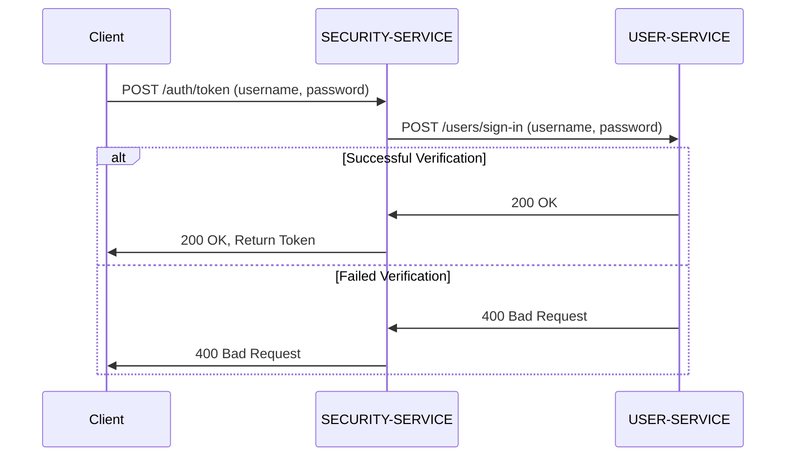

# SECURITY-SERVICE API

## 토큰 생성

**POST** `/auth/token`

이 API는 새로운 토큰을 생성합니다.

---

## 인증 주체 조회

**GET** `/auth/token`

이 API는 토큰에 대응되는 인증 주체를 반환합니다.

---

## 토큰 갱신

**GET** `/auth/token-refresh`

이 API는 토큰을 갱신하여 반환합니다.

---

## 토큰 발급 시나리오

1. `SECURITY-SERVICE`에 `POST /auth/token` 토큰 생성 요청(username, password)
2. `USER-SERVICE`에 `POST /users/sign-in` 사용자 인증 요청(username, password)
3. `USER-SERVICE`의 응답 코드가 200인 경우 `USER-SERVICE`에서 응답 코드 200, 토큰을 반환
3. `USER-SERVICE`의 응답 코드가 400인 경우 `SECURITY-SERVICE`에서 응답 코드 400을 반환

