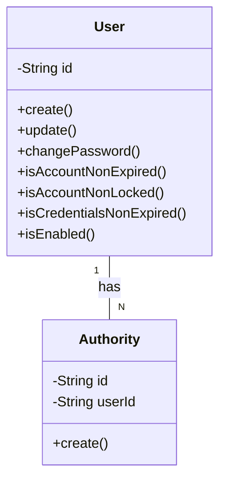

# USER-SERVICE
[프로젝트 정보](#프로젝트-정보)  
[도메인 엔티티](#도메인-엔티티)
[OpenAPI](#OpenAPI)

## 프로젝트 정보

- **프로그래밍 언어**: Java
- **Java 버전**: 17
- **빌드 도구**: Gradle
- **스프링 부트 버전**: 3.2.2
- **스프링 클라우드 버전**: 2023.0.0

---
## 도메인 엔티티

---

## OpenAPI
[계정 OpenAPI](docs%2Fuser-api-docs.yaml)

---