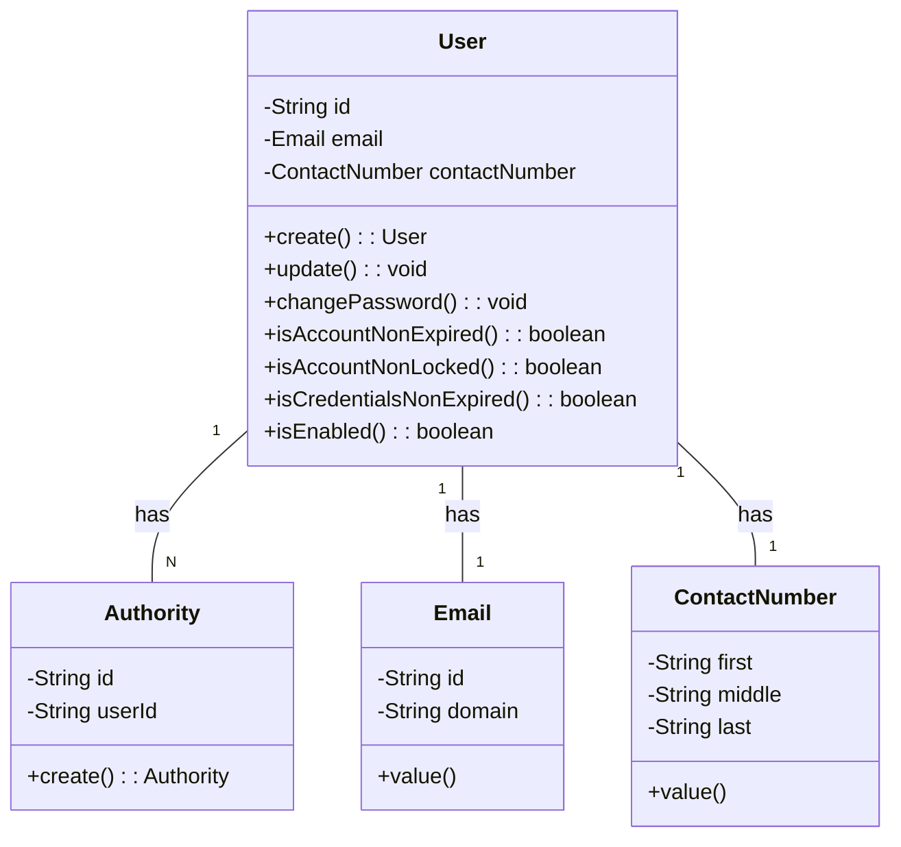
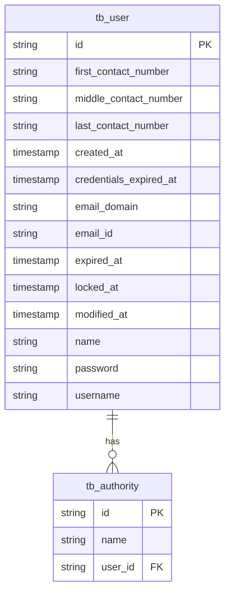

# User Service
`user-service`는 사용자 정보를 관리하는 서비스입니다.

---

## 목차
1. [프로젝트 정보](#프로젝트-정보)  
2. [Domain](#domain)
3. [Entity Relationship Diagram](#entity-relationship-diagram)
3. [Open API Specification](#open-api-specification)

---

## 프로젝트 정보

---

## Domain

---

## Entity Relationship Diagram

---

## Open API Specification
[API 명세 바로가기](docs%2Fuser-api-docs.yaml)